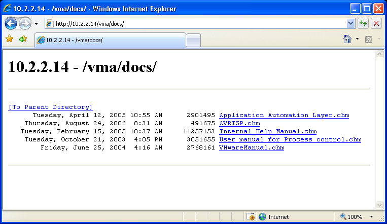
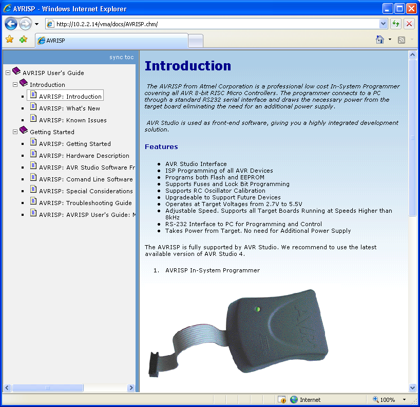
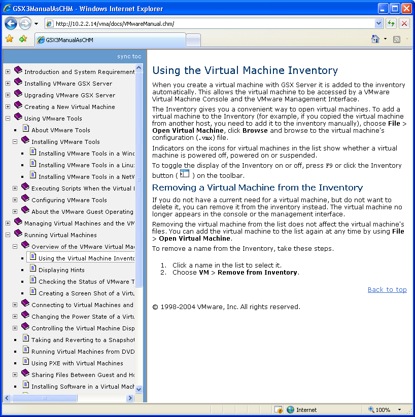

CHMBrowser
==========

Last update: 2004

Publish CHM documentation ( Microsoft Compressed HTML Help ) on web using an Http Handler. Once the Http Handler is installed on IIS the CHM documentation will be available to remote clients like a regular web site.

The best part of this tool is that there is no need to preprocess the CHM files! Just drop them on your web server and automatically the remote clients will see them like regular web pages. Since the output of this tool is platform-independent, users can use whatever browser they like to read the documentation.

CHM Browser Key Features
------------------------

- publish CHM documentation on web without preprocessing;
- on the fly publish of CHM documents on web (just drop the CHM files on a web server and see the results);
- help documentation outputted by the component is platform-independent and browser-independent;
- CHM Browser helps search engines ( internet or intranets ones ) to index the content of CHM files;
- Published CHM documents maintain original CHM tree structure;

Why publish CHM files online?
-----------------------------

- to make available products documentation to corporate users on company intranet portal;
- to better control documentation versioning;
- creating documentation in CHM format helps you target offline customers, while publishing CHM documents on web helps online customers;
- using CHM browser component users don’t have to download big CHM files. They’ll just browse/search the section they are interested in.

CHM Browser configuration 
-------------------------

CHM Browser Http Handler is a .NET component (requires Microsoft .NET Framework 1.1+). Configuration of this component is achieved via editing a simple XML format file: Web.config

One of the most important features that you’ll want to configure here is a YES/NO parameter that specifies if download of original CHM file is allowed. If download is not allowed, remote clients will be able to only browse the content of CHM files without downloading the entire file.

Example:

Let’s suppose we have a CHM file (tutorial.chm ) hosted on a web server with this component.

To download the CHM (supposing you are allowed to) you’ll have to point your browser to:

http://server/yourpath/tutorial.chm

To browse the CHM file directly on the server, point the browser to:

http://server/yourpath/tutorial.chm/

Note that the second URL has only a slash (/) appended to the address. Imagine this like CHM file is a folder.

Screenshots
-----------

A web folder in browse mode

Reading a CHM document

Reading a CHM document

Note: This web application would not be possible without the excelent "HtmlHelp library" by Klaus Weisser from https://www.codeproject.com/Articles/6765/HtmlHelp-library-and-example-viewer

